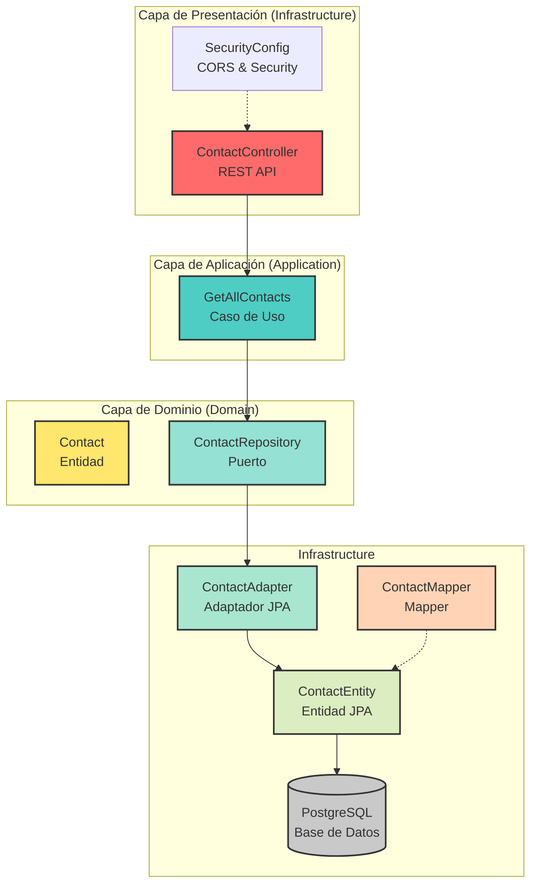
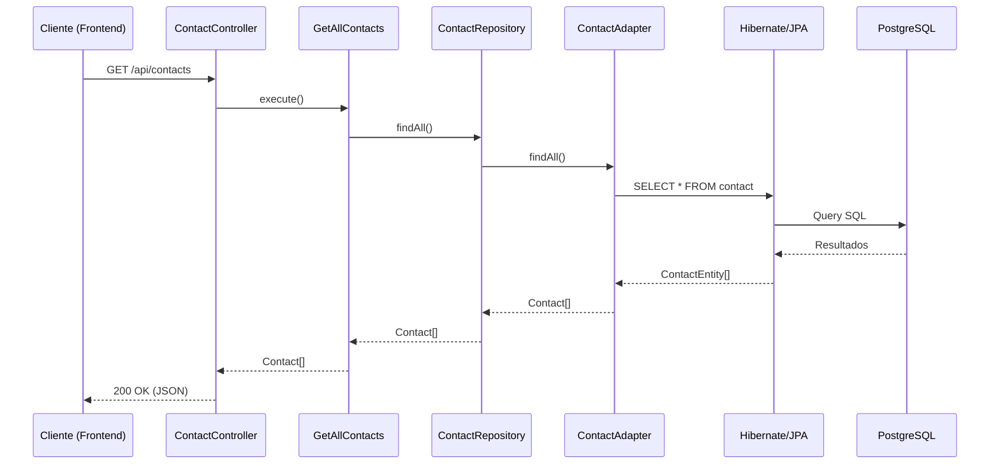

# Arquitectura Hexagonal - CRM Backend

## ¿Qué es la Arquitectura Hexagonal?

La Arquitectura Hexagonal (también conocida como Ports and Adapters o Arquitectura de Puertos y Adaptadores) es un patrón de diseño que busca crear aplicaciones **libres de dependencias externas**, permitiendo que el núcleo de la lógica de negocio sea independiente de frameworks, bases de datos y interfaces de usuario.

### Principios Fundamentales

1. **Separación de Responsabilidades**: La lógica de negocio está aislada del mundo exterior
2. **Inversión de Dependencias**: Las dependencias apuntan hacia el núcleo, nunca al revés
3. **Puertos y Adaptadores**: Los puertos definen interfaces, los adaptadores las implementan

### Beneficios

- **Testabilidad**: La lógica de negocio se puede probar sin dependencias externas
- **Mantenibilidad**: Cambios en infraestructura no afectan el dominio
- **Flexibilidad**: Puedes cambiar de base de datos o framework sin reescribir lógica
- **Reusabilidad**: El núcleo es independiente y reusable

---



---

## Arquitectura del Proyecto

### Estructura de Capas

```
src/main/java/com/crm/
├── domain/                    # 🔵 NÚCLEO (Dominio)
│   ├── model/               # Entidades del negocio
│   │   └── Contact.java
│   └── port/                # Interfaces/Puertos
│       └── ContactRepository.java
│
├── application/              # 🟢 Aplicación (Casos de Uso)
│   └── usecase/
│       └── GetAllContacts.java
│
└── infrastructure/           # 🔴 Infraestructura (Adaptadores)
    ├── adapter/
    │   ├── ContactEntity.java      # Entidad JPA
    │   └── ContactAdapter.java     # Implementación del repositorio
    ├── mapper/
    │   └── ContactMapper.java      # Mapper Domain <-> Entity
    ├── controller/
    │   └── ContactController.java # Endpoints REST
    └── config/
        ├── SecurityConfig.java    # Seguridad
        └── CorsConfig.java         # CORS
```

### Flujo de Datos



---

## Tecnología y Ambiente

### Stack Tecnológico

| Componente | Tecnología |
|------------|------------|
| Backend | Spring Boot 4.0.4 + Java 17 |
| Base de Datos | PostgreSQL 15 |
| Seguridad | Spring Security + JWT |
| API Docs | SpringDoc OpenAPI |
| Build | Maven |

### Docker

El proyecto utiliza Docker para levantar la base de datos PostgreSQL.

```yaml
# docker-compose.yml
services:
  postgres:
    image: postgres:15
    environment:
      POSTGRES_DB: crm_db
      POSTGRES_USER: postgres
      POSTGRES_PASSWORD: postgres
    ports:
      - "5432:5432"
    volumes:
      - postgres_data:/var/lib/postgresql/data
```

### Configuración de Conexión

```yaml
# application.yml
spring:
  datasource:
    url: jdbc:postgresql://localhost:5432/crm_db
    username: postgres
    password: postgres
  jpa:
    hibernate:
      ddl-auto: update  # Auto-crea las tablas
```

### Puertos

| Servicio | Puerto |
|----------|--------|
| Backend (Spring Boot) | 8080 |
| PostgreSQL | 5432 |
| Frontend (Vite) | 5173 |

---

## Descripción de Componentes

### Domain (Núcleo)
- **Contact**: Entidad del dominio que representa un contacto del CRM
- **ContactRepository**: Puerto (interfaz) que define las operaciones de persistencia

### Application
- **GetAllContacts**: Caso de uso que implementa la lógica de negocio para obtener todos los contactos

### Infrastructure
- **ContactController**: Controlador REST que expone los endpoints de la API
- **ContactAdapter**: Adaptador que implementa el puerto usando JPA
- **ContactEntity**: Entidad JPA para el mapeo con la base de datos
- **ContactMapper**: Mapper para convertir entre dominio e infraestructura

---

## Endpoints Disponibles

| Método | Endpoint | Descripción |
|--------|----------|-------------|
| GET | `/api/contacts` | Obtiene todos los contactos |
| GET | `/api/contacts/{id}` | Obtiene un contacto por ID |
| POST | `/api/contacts` | Crea un nuevo contacto |
| PUT | `/api/contacts/{id}` | Actualiza un contacto |
| DELETE | `/api/contacts/{id}` | Elimina un contacto (soft delete) |

### Documentación API

Swagger disponible en: `http://localhost:8080/swagger-ui/index.html`
